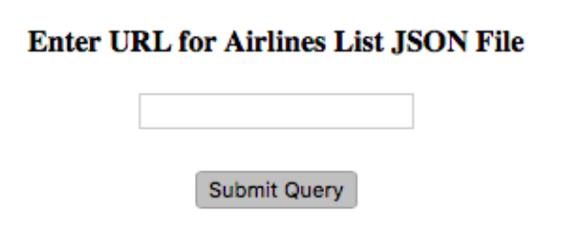

# Web-Technologies
# USC CSCI571 Web Technologies Projects:

## Project 3:
	Given a image of a web page, reproduce the page as closely as possible, writing HTML and CSS directly, that is without using anything more than a text editor.

	Web Page:
	

## Project 4:
	Write a HTML/JavaScript program, which takes the URL of a JSON document containing US Airlines information, parses the JSON file, and extracts the list of airlines, displaying them in a table. The JavaScript program will be embedded in an HTML file so that it can be executed within a browser.
	
### Search Box:
	

	Plane Table Sample:
	

## Project 5:
	Install Apache 2.2.22, Nginx 1.0.15, PHP 5.4.5

## Project 6:
	Allow you to search for stock information using the Stock quote API, and the results will be displayed in both tabular format and charts format using HighCharts. News clips will also be provided for the selected stock.

	Search Box:
	

	Result Display:
	
